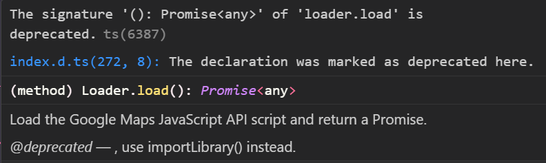
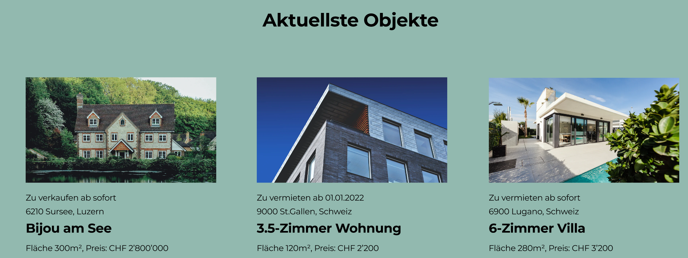
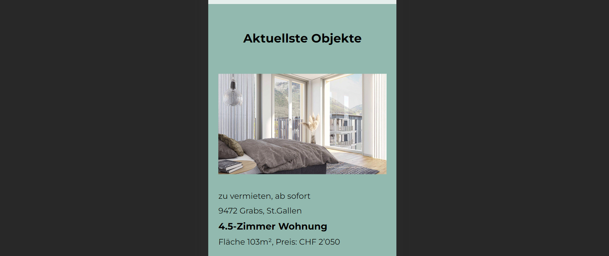
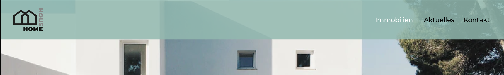

# Technische Dokumentation: DEV Diplomarbeit "Home & House"

## Inhaltsverzeichnis

- [Abstract / Management Summary](#abstract--management-summary)
- [Setup Guide](#setup-guide)
- [URL der lauffähigen Version](#url-der-lauffähigen-version)
- [Zeitplan / Meilensteine](#zeitplan--meilensteine)
- [Technologiekonzept inkl. Evaluation der eingesetzten Technologien, Begründung](#technologiekonzept-inkl-evaluation-der-eingesetzten-technologien-begründung)
- [Technische Dokumentation bei Eigenleistungen](#technische-dokumentation-bei-eigenleistungen)
- [Zusammenfassung und Ausblick, persönliche Anmerkungen](#zusammenfassung-und-ausblick-persönliche-anmerkungen)
- [Literaturverzeichnis, Quellenangaben bei Nutzung von externem Code](#literaturverzeichnis-quellenangaben-bei-nutzung-von-externem-code)
- [Eidesstattliche Erklärung ](#eidesstattliche-erklärung)

## Abstract / Management Summary

### Aufgabenstellung / Ziel

Der Auftrag bestand darin, eine Web-Applikation für das fiktive Immobilienunternehmen "Home & House" zu entwickeln. Das Layout und Design musste anhand der Vorgaben im [Figma](https://bit.ly/3trxvOW) umgesetzt werden. Programmiert werden sollte die Web-Applikation mit HTML, CSS (vorzugsweise SCSS) und JavaScript. Das Backend wurde zur Verfügung gestellt. Das Projekt musste mit [GitHub](https://github.com/) versioniert werden. Dafür wurde ein von der Lehrgangsleitung erstelltes [Repository](https://github.com/WebProfessionals/dev23_lea) verwendet. Neben der technischen Umsetzung sollte auch eine Dokumentation mit vordefinierten Inhaltspunkten in Form einer README-Datei verfasst werden.

### Zeitplan

Nachdem ich mich mit der Aufgabenstellung und den Zielen auseinandergesetzt habe, habe ich einen Zeitplan erstellt. Folgend erläutere ich die wichtigsten Punkte des Vorgehens:

- Definition der verschiedenen "Bereiche" der Diplomarbeit. Dazu gehören zusammengefasst das **Projektmanagement**, die **Dokumentation** und die **Entwicklung** der Applikation.
- Definition von Tasks und Subtasks
- Erstellung eines Zeitplans
- Definition von Milestones
- Schätzung der benötigten Zeit pro Task

Bezüglich der eingeplanten Zeit pro Task hat es während der Entwicklung einige Verschiebungen gegeben, da ich oft zu wenig oder auch zu viel Zeit eingeplant hatte.

Detailliertere Informationen zum Zeitplan sind [hier](#zeitplan--meilensteine) beschrieben.

### Entwicklung

Nach der Erstellung des Zeitplans habe ich mit der eigentlichen Entwicklung begonnen. Ich konnte mich zu einem grossen Teil an die Reihenfolge aus meinem Zeitplan halten. Als erstes habe ich die HTML-Struktur der Website entwickelt. Anschliessend habe ich mich um die Gestaltung mit SCSS gekümmert und danach habe ich die JavaScript Programmierung durchgeführt. Ausführliche Informationen zur Entwicklung und Evaluation können [hier](#technologiekonzept-inkl-evaluation-der-eingesetzten-technologien-begründung) eingesehen werden.

### Probleme / Schwierigkeiten

Mein grösstes Problem bei der Diplomarbeit war der zeitlich vorgebene Rahmen. Obwohl ich seit Beginn fast täglich am Projekt gearbeitet habe, stand ich unter Zeitdruck. Dazu geführt hat vermutlich zum einen, dass ich mich zu Beginn zu sehr auf Details fokussiert hatte und mir im Allgemeinen viel Zeit für alles genommen habe.

## Setup Guide

### npm-Pakete installieren

Nachem das Git-Repository geklont wurde, das Projekt im Code Editor öffnen und den folgenden Befehl ausführen:

```
npm install
```

Damit werden alle verwendeten npm-Pakete installiert.

Danach kann entweder der **Production-Mode** oder der **Development-Mode** gestartet werden.

### Development-Mode

Um den **Development-Mode** zu starten, muss der folgende Befehl ausgeführt werden:

```
npm run dev
```

### Production-Mode

Um den **Production-Mode** zu starten, muss der folgende Befehl ausgeführt werden:

```
npm run build
```

## URL der lauffähigen Version

Diese Diplomarbeit ist unter der Domain [home-and-house-19aa48ad56c8.herokuapp.com](https://home-and-house-19aa48ad56c8.herokuapp.com/) erreichbar.

## Zeitplan / Meilensteine

Meinen Projekt- und Zeitplan habe ich mit dem Tool [ClickUp](https://clickup.com/) erstellt. Folgend erläutere ich mein grobes Vorgehen.

### Vorgehen

- Definition von "Scopes". Dies sind die verschiedenen "Bereiche" der Diplomarbeit. Dazu gehören:
  - Project Management
  - Development: Tools
  - Documentation
  - Development: GitHub
  - Development: HTML
  - Development: CSS
  - Development: JavaScript
  - Development: Server/Domain
  - Development: Testing
  - Development: Extra tasks
- Definition von Tasks und Subtasks
- Erstellung eines Zeitplans in Form einer Zeitleiste
- Definition von Milestones
- Schätzung der benötigten Zeit pro Task

Ich habe versucht, die Planung möglichst detailliert, aber dennoch mit Bedenken des zeitlich vorgegeben Rahmens, zu erarbeiten. Die Planung bringt für mich folgende Vorteile:

- Genaue Befassung mit den Anforderungen vor der Entwicklung
- Risikominimierung, dass Anforderungen oder Tasks untergehen
- Einfachere Einhaltung der Deadlines

**Kurz: Es ist mein roter Faden zur Durchführung und Entwicklung dieses Projektes.**

### Projekt-/Zeitplan

Folgend ist der Projekt-/Zeitplan im Soll-Zustand:


Folgend ist der Projekt-/Zeitplan im Ist-Zustand:

**UPDATE FOLGT**

#### Zusammenfassung

An meinen Zeitplan konnte ich mich leider nicht so gut halten. Ich kam bereits zu Beginn in Verzug. Zum einen habe ich für das Projektmanagement, genauer gesagt die Projektplanung, mehr Zeit gebraucht als erwartet. Ich finde aber, sie hat mir die Arbeit während des Projektes erheblich erleichtert. Mit dem eingesetzten Tool, konnte ich ganz einfach meine Zeit pro Task erfassen und habe so auch für die Zukunft ein besseres Gefühl für die Zeitplanung erhalten. Daneben war auch die Installation aller Tools etwas zeitaufwändiger als angenommen.

Während ich bei der HTML-Entwicklung zu viel Zeit eingeplant hatte, habe ich für die SCSS-Entwicklung zu wenig einberechnet. Ein Grund dafür war sicher, dass ich einige Aufgaben nicht eingeplant hatte, die ich dann noch nachträglich in meiner Projektplanung ergänzt und auch getrackt habe. Ich wollte mir am Anfang eine saubere Struktur aufbauen und habe dabei etwas Zeit verloren. Daneben habe ich auch für Dinge länger gebraucht, die ich bisher noch nie so umgesetzt hatte, wie beispielsweise die Hamburger Navigation.

Ich hatte mir bei der Projektplanung für JavaScript absichtlich etwas grosszügiger Zeit eingeplant, da ich bei den Übungen oft gemerkt hatte, dass ich bei der Umsetzung dann deutlich länger gebraucht hatte, als ursprünglich angenommen. Schlussendlich war es dann aber doch etwas zu viel Zeit, die ich in Zukunft eher bei der Entwicklung von SCSS einplanen würde.

Zusammengefasst lässt sich sagen, dass ich tendenziell etwas zu wenig Zeit für die einzelnen Aufgaben eingeplant hatte, was ich bei der nächsten Projektplanung berücksichtigen würde. Schlussendlich konnte ich die Aufgaben dann aber in der vorgegebenen Zeit erledigen, wobei ich aber auf Extra Tasks verzichten musste.

## Technologiekonzept inkl. Evaluation der eingesetzten Technologien, Begründung

Ich verwende die Technologien, die wir im Unterricht erlernt haben:

- HTML
- BEM Namenskonvention für CSS-Klassen
- SCSS/CSS (Sass)
- Javascript Module Pattern
- Webpack
  - npm
  - Mode "Development" & "Production"
  - Loaders (für SCSS)
  - Cache Busting (mit Content-Hash)
  - HTML Webpack Plugin
  - Webpack Dev Server
  - HTML-Loader & Asset Modules
  - Clean Webpack Plugin
  - FOUC
  - CSS Extract
  - Multi Entrypoints
  - Includes (Partials)
  - ImageMinimizerWebpackPlugin
- GraphQL (Abfragesprache für API)
- GitHub

Zusätzlich dazu habe ich folgende Tools verwendet:

- [Prettier - Code Formatter](https://marketplace.visualstudio.com/items?itemName=esbenp.prettier-vscode)
- [Google Maps JavaScript API Loader](https://www.npmjs.com/package/@googlemaps/js-api-loader)
- [Heroku](https://www.heroku.com/)
  - [Express Server](https://www.digitalocean.com/community/tutorials/nodejs-serving-static-files-in-express)

### BEM Namenskonvention

Ich habe mit der Namenskonvention BEM gearbeitet und mich anfangs zuerst etwas eingelesen. Ich habe versucht die Best-Practices anzuwenden. Je länger ich damit gearbeitet habe, desto leichter ist es mir gefallen. Mein Ziel war es, über alle HTML-Seiten und CSS-Klassen hinweg, eine gewisse Einheitlichkeit reinzubringen. Zu Beginn hatte ich noch versucht, jeweils mit einzelnen Wörtern zu arbeiten. Folgend ein kurzes Beispiel:

**Erster Ansatz:**

- Block (`<div>`): `contact`
- Element auf erster Stufe (`<div>`): `contact__links`
- Element auf zweiter Stufe (`<ul>`): `contact__list`
- Element auf dritter Stufe (`<li>`): `contact__item`
- Element auf vierter Stufe (`<a>`): `contact__link`

Ich habe aber mit diesem Vorgehen schnell die Klarheit über die Zuweisung der einzelnen Klassen verloren. Deshalb habe ich die Namen dann nach folgendem Schema benannt:

**Umgesetzter Ansatz:**

- Block (`<div>`): `contact`
- Element auf erster Stufe (`<div>`): `contact__links`
- Element auf zweiter Stufe (`<ul>`): `contact__link-list`
- Element auf dritter Stufe (`<li>`): `contact__link-list-item`
- Element auf vierter Stufe (`<a>`): `contact__link-item`

Da in einem Block oft mehrere verschachtelte Elemente enthalten sind, fand ich es hilfreich, wenn auch bei der Benennung von Elementen die Zugehörigkeit klarer zu erkennen ist.

Auch von den Modifiern habe ich Gebrauch gemacht, die ich als sehr nützlich empfand. So konnte ich übersichtlich spezifische Styles einzelnen Elementen zuweisen. Die Styles, die alle Elemente betreffen, konnte ich währenddessen der Klasse ohne Modifier zuweisen. Folgend auch dazu ein kurzes Beispiel:

- Klasse aller Elemente: `contact__link-item`
- Klasse einzelner Elemente: `contact__link-item--bold`

Ich persönlich habe die BEM Namenskonvention als eine gute Praxis erfahren und hoffe dadurch mehr Klarheit in meinen Code gebracht zu haben.

Ich habe das Design der Applikation komplett mit den CSS-Klassen umgesetzt. Ich habe keine Styles auf HTML-Tags oder IDs angewendet. Was ich aber gebraucht habe, sind Pseudo-Klassen (beispielsweise `:hover`) und Pseudo-Elemente (beispielsweise `::after`).

### SCSS

#### Ordner-/Dateistruktur

Bei der Arbeit mit SCSS wollte ich mir eine saubere Struktur aufbauen. Ich bin bei meiner Recherche auf das [SCSS 7-1 Pattern](https://sass-guidelin.es/#the-7-1-pattern) gestossen und habe mich dazu entschieden, meinen Code anhand dieses Schemas zu strukturieren. Da ich vom Schema die Ordner `themes/` und `vendors/` aber nicht benötigte, habe ich diese entsprechend weggelassen.

#### Media Queries

In Bezug auf die Media Queries habe ich mich für die [Bootstrap 4 Breakpoints](https://getbootstrap.com/docs/5.0/layout/breakpoints/#available-breakpoints) entschieden. Die Breakpoints habe ich mit SCSS Mixins umgesetzt:

```scss
/* media queries */
@mixin for-size($size) {
  @if $size == small {
    @media (min-width: 576px) {
      @content;
    }
  } @else if $size == medium {
    @media (min-width: 768px) {
      @content;
    }
  } @else if $size == large {
    @media (min-width: 992px) {
      @content;
    }
  } @else if $size == x-large {
    @media (min-width: 1200px) {
      @content;
    }
  } @else if $size == xx-large {
    @media (min-width: 1400px) {
      @content;
    }
  }
}
```

Ich fand diese Umsetzung übersichtlich und habe während der Entwicklung gut damit arbeiten können. Ich empfinde es als Vorteil, dass die Styles für die verschiedenen Bildschirmgrössen direkt beim jeweiligen Element festgelegt werden können, und nicht zwischen den einzelnen Media Queries hin und her gesprungen werden muss. Folgend ein kurzes Anwendungsbeispiel:

```scss
.page-title {
  font: {
    family: $font-family-heading;
    weight: $font-weight-regular;
    size: 1.5rem;
  }
  @include for-size(large) {
    font-size: 3.4rem;
  }
}
```

#### Variablen

Ich habe in meinem Projekt Variablen für die Farben und Schriften verwendet. Etwas genauer möchte ich auf die Farbvariablen eingehen:

Ich bin auf die [Tier 1 und Tier 2 Struktur](https://markus.oberlehner.net/blog/two-tier-sass-variables-and-css-custom-properties/) gestossen, welche ich direkt sinnvoll und praktisch fand, weshalb ich dies bei der Diplomarbeit angewendet habe. Untenstehend gehe ich kurz genauer darauf ein.

- **Tier 1:** Auf der ersten Stufe habe ich alle Farben festgelet, die aktuell für das Projekt verwendet werden. Diese habe ich noch in _Base_ und _Brand_ eingeteilt:

```scss
/* base (tier 1) */
$base-primary: #ffffff; /* white */
$base-secondary: #000000; /* black */

/* brand (tier 1) */
$brand-primary: #92b9af; /* dark-green */
$brand-secondary: #e5eeec; /* light-green */
$brand-primary-transp: rgba($brand-primary, 0.85); /* dark-green transparent */
$brand-tertiary: #878787; /* grey */
```

- **Tier 2:** Anstelle direkt die Variablen aus Tier 1 im SCSS zu verwenden, habe ich eine zweite Stufe von Variablen erstellt. Diesen Variablen habe ich jeweils die Variablen aus Stufe 1 zugewiesen. Tier 2 bezieht sich hier auf die häufigsten Elemente und Anwendungsbereiche:

```scss
/* background (tier 2) */
$bg-primary: $brand-secondary; /* light-green */
$bg-secondary: $brand-primary; /* dark-green */
$bg-secondary-transp: $brand-primary-transp; /* dark-green transparent */
$bg-tertiary: $base-primary; /* white */
$bg-tertiary-transp: rgba($base-primary, 0.45); /* white transparent */

/* text (tier 2) */
$txt-primary: $base-secondary; /* black */
$txt-secondary: $brand-primary; /* dark-green */
$txt-tertiary: $base-primary; /* white */

/* button (tier 2) */
$btn-primary: $brand-primary; /* dark-green */
$btn-secondary: $brand-tertiary; /* grey */
$btn-tertiary: $base-secondary; /* black */
$btn-txt: $base-primary; /* white */
```

Dadurch können in Zukunft einfacher Farbanpassungen implementiert werden. Wenn beispielsweise nur die Farbe des Textes auf der Website angepasst werden soll, kann dies aufgrund der zweiten Stufe gemacht werden, ohne bei anderen Elementen ebenfalls die Farbe zu beeinflussen oder diverse Stellen im Code anpassen zu müssen.

Wenn sich aber beispielsweise bei einem Rebranding eine oder mehrere Farben des Unternehmens ändern, kann dies auf Stufe 1 aktualisiert werden. Die entsprechenden Variablen auf Stufe 2 werden dann automatisch angepasst.

### Google Maps

Ich habe zuerst das [Bootstrap-Ladeprogramm](https://developers.google.com/maps/documentation/javascript/overview?hl=de#bootstrap_loader) verwendet, um die Google Maps Karte einzubetten. Dies hat dazu geführt, dass ich ein ziemlich grosses und unverständliches Code-Snippet in meiner `kontakt.js` Datei hatte. Ich habe dies dann nachträglich angepasst, und die Karte mit dem npm Plugin [Google Maps JavaScript API Loader](https://www.npmjs.com/package/@googlemaps/js-api-loader) eingebettet. Dadurch wurde mein Code übersichtlicher.

Bei der Implementierung der Karte, war auf der [Google Maps Platform](https://developers.google.com/maps/documentation/javascript/overview?hl=de#js_api_loader_package) noch veralteter Code:

```js
loader.load().then(async () => {
  // ...
});
```



Mithilfe dieses [GitHub-Beispiels](https://github.com/googlemaps/js-api-loader#example), habe ich den Code mit der `importLibrary()` Funktion auf den neusten Stand gebracht. Bei der Umstellung der Google Maps Integration habe ich Unterstützung von meinem Dozenten Pascal Helfenstein erhalten.

Ich habe das Copyright & die Nutzungsbedingungen mit CSS ausgeblendet. Auf einer produktiven Seite ist dies vermutlich aufgrund der [Nutzungsbedingungen](https://cloud.google.com/maps-platform/terms/) nicht erlaubt.

### Struktur JavaScript-Dateien

Ich habe für jede HTML-Datei eine eigene JavaScript-Datei. In einigen Dateien wird lediglich die Datei `site-wide.js` importiert. Dies ist der Header der Website. Anfangs hatte ich geplant, dort auch den Footer der Seite einzubauen. Da der Footer aber auf der Seite _Kontakt_ nicht zu sehen sein soll, hat dies nicht funktioniert. Ich habe mich deshalb entschieden, für den Footer eine separate JavaScript-Datei anzulegen und diese ebenfalls auf den einzelnen Seiten zu importieren.

### Design Abweichungen

Ich bin bei den untenstehenden Punkten vom Design im Figma abgewichen. Zur Veranschaulichung sind jeweils Screenshots integriert.

#### Objekt Detailseite: Link

Auf der Objekt Detailseite unter dem Abschnitt "Aktuellste Objekte" gibt es den Link "Alle Objekte anzeigen". Laut Figma sollte der Link beim Hover die gleiche Farbe annehmen, wie der Hintergrund. Dies machte für mich keinen Sinn, weshalb ich mich für die Farbe weiss als Hover-State entschieden habe.

**Link ohne Hover**


**Link mit Hover gemäss Figma**


**Link mit Hover umgesetzt**


#### Objekt Detailseite: Titel

Gemäss Figma fehlt auf der Objekt Detailseite im Abschnitt "Aktuellste Objekte" der Titel. Ich finde, dass der Titel auch auf Mobile sinnvoll ist und zeige ihn deshalb auch dort an.

**Titel auf Desktop gemäss Figma**



**Titel auf Mobile gemäss Figma**


**Titel auf Mobile umgesetzt**



#### Navigation: Aktiv-Status

Auf Desktop soll gemäss Figma die aktuelle Seite in der Navigation gekennzeichnet sein. Dies ist in der Mobile Navigation im Figma nicht enthalten. Für mich persönlich macht das auch auf Mobile Sinn, weshalb ich es dort umgesetzt habe.

**Navigation auf Desktop gemäss Figma**



**Navigation auf Mobile gemäss Figma**


**Navigation auf Mobile umgesetzt**


### Hosting

Für das Hosting habe ich mir die folgenden Anbieter angeschaut:

- [Netlify](https://www.netlify.com/)
- [Vercel](https://vercel.com/)
- [Heroku](https://www.heroku.com/)
- [Docker](https://www.docker.com/)

Schlussendlich habe ich mich dann für die Umsetzung mit Heroku entschieden. Dies aus dem Grund, da ich dann noch die Möglichkeit hätte, ein Backend einzubauen und ich Heroku auch einfach einmal ausprobieren wollte. Die Umsetzung hat gut funktioniert aber ich musste noch zusätzliche [Vorkehrungen](#technische-dokumentation-bei-eigenleistungen) treffen, da ich kein eigenes Backend habe.

### Umsetzung Detailseiten

Bei der Umsetzung der Detailseiten habe ich mit einer "Template HTML-Datei" gearbeitet (`objekt.html`). Sobald auf ein Immobilienobjekt geklickt wird, wird die zugehörige ID als Parameter der URL übergeben. Dadurch gibt es für jedes Immobilienobjekt eine separate URL mit folgendem Schema:
`https:/.../objekt.html?propertyId=19`

Auf der Detailseite wird die ID aus der URL ausgelesen und dazu verwendet, die entsprechenden Inhalte mit GraphQL abzufragen und schlussendlich im Frontend auszugeben.

Ich habe mich dafür entschieden, den grössten Teil des HTMLs aus dem Template zu laden und nicht alles in JavaScript zu generieren. Dies hatte ich Anfangs versucht, fand es dann aber aufgrund der Menge des HTMLs und der verschiedenen Klassen sehr unübersichtlich. Deshalb füllle ich jetzt nur die dynamischen Inhalte mit JavaScript ins HTML ein.

Dies hatte ich zuerst auch bei den Bildern so gelöst. Sprich ich hatte 4 Bild-Elemente in meiner `objekt.html` Datei, die ich dann mit JavaScript befüllt habe. Sofern es weniger als 4 Bilder in der Datenbank hatte, wurden die leeren Bild-Elemente aus dem HTML entfernt. Dies bedeutete aber, dass die Anpassungsfähigkeit nicht gewährleistet war, wenn es irgendwann mehr wie 4 Bilder pro Immobilienobjekt in der Datenbank gibt. Deshalb habe ich es umstrukturiert und in JavaScript einen Loop für die Bildelemente eingebaut. Sofern ein Bildelement in der Datenbank vorhanden ist, wird das HTML-Element mithilfe von JavaScript erstellt. Input in Bezug auf die Implementierung der Bilder habe ich von meinem Dozenten Pascal Helfenstein erhalten.

### Prettier - Code Formatter

Ich habe bei der Entwicklung des Codes zum ersten Mal mit dem [Prettier Code Formatter](https://marketplace.visualstudio.com/items?itemName=esbenp.prettier-vscode) gearbeitet. Damit wollte ich sicherstellen, dass mein Code einheitlich formatiert ist. Das Einzige was mich daran gestört hat, waren die automatischen Zeilenumbrüche, da diese im HTML ein paar Mal zu Fehlern geführt hat, sowie der Code im JavaScript teilweise etwas unschön aussieht. Ich habe die erlaubten Zeichen pro Zeile einige Male angepasst, um es etwas zu optimieren.

### Github

Da ich auch während der Unterrichtszeit mit GitHub gearbeitet habe, hatte ich die grundlegenden Git-Befehle bereits im Kopf. Ich war mir anfangs eher etwas unsicher bezüglich der Git Commits beziehungsweise der Commit-Messages. Ich habe versucht regelmässig und bei für mich sinnvollen Aufgabenfortschritten zu commiten. Nach den ersten paar vermutlich leicht zu langen Messages, habe ich versucht mich kürzer zu halten und in diesem Sinne auch weniger Fortschritte in einem einzelnen Commit zusammenzufassen.

## Technische Dokumentation bei Eigenleistungen

### Heroku mit Express Server

Da ich das Hosting Heroku ohne ein eigenes Backend verwende, musste ich einen kleinen Express Server einbauen, der den Port zuweist und konfiguriert. Zudem konnte ich nicht mehr den Befehl `npm start` für den Developer-Mode verwenden, da dieser Befehl von Heroku gebraucht wird. Für die Umsetzung habe ich mich an diesem [Artikel von DigitalOcean](https://www.digitalocean.com/community/tutorials/nodejs-serving-static-files-in-express) sowie an diesem [Artikel von Heroku](https://devcenter.heroku.com/articles/nodejs-support#build-behavior) orientiert. Dabei unterstützt hat mich mein Dozent Pascal Helfenstein.

## Zusammenfassung und Ausblick, persönliche Anmerkungen

Ich konnte die Applikation meines Erachtens gemäss der vorgegebenen Ziele entwickeln. Sie ist funktionsfähig und unter der folgenden URL erreichbar: [home-and-house-19aa48ad56c8.herokuapp.com](https://home-and-house-19aa48ad56c8.herokuapp.com/)

Ich musste relativ schnell feststellen, dass ich mich nicht ganz so gut an meinen Zeitplan halten kann. Dies aus dem Grund, da ich bereits zu Beginn in Verzug kam, aufgrund der Projektplanung, der Installation aller Tools und dem Aufbau der Struktur.

Vieles habe ich während der Entwicklung zum ersten Mal in dieser Form programmiert. Ich habe dabei so gut wie möglich versucht, alles im Unterricht Gelernte umzusetzen. Bei jeder Auszeichnungssprache und Programmiersprache musste ich mich am Anfang zuerst wieder etwas zurechtfinden. Je länger ich wieder damit gearbeitet habe, desto besser ging es.

Ich habe durch die Durchführung dieses Projektes vieles gelernt und freue mich, dies bei zukünftigen Projekten anzuwenden.

## Literaturverzeichnis, Quellenangaben bei Nutzung von externem Code

### Mobile Hamburger Navigation

Für die Mobile Hamburger Navigation habe ich mich an folgendem Artikel orientiert: ["Easy hamburger menu with JS - Beginners"](https://dev.to/ljcdev/easy-hamburger-menu-with-js-2do0). Den CSS und JavaScript Code habe ich in meine bereits bestehendes HTML-Struktur eingebaut. Um das gewünschte Ergebnis zu erzielen, habe ich ein paar Anpassungen und Ergänzungen vorgenommen (bspw. `overflowY`).

### Toggle Switch

Für den Toggle Switch habe ich mich am ersten Switch "Light" aus folgendem Code orientiert: [Codepen: CSS Toggle Switch button](https://codepen.io/alvarotrigo/pen/RwjEZeJ). Auch hier habe ich den Code für meine Zwecke modifiziert.

### Scroll-to-Top Button

Für den Scroll-to-Top Button habe ich mich am Code aus folgendem Artikel orientiert (Option 1): [How to Make an Unobtrusive Scroll-to-Top Button](https://css-tricks.com/how-to-make-an-unobtrusive-scroll-to-top-button/)

### Aktives Navigationselement

Um das aktive Navigationselement zu kennzeichnen, habe ich mich an dem YouTube-Tutorial [Active Nav Link Indicator with Vanilla Javascript](https://www.youtube.com/watch?v=JkuiKeNS2mg&t=337s) orientiert. Ich habe den Code entsprechend modifiziert, damit er auf meiner Website wie gewünscht funktioniert.

### ChatGPT

Hauptsächlich bei der Entwicklung von JavaScript habe ich auch auf [ChatGPT](https://chat.openai.com/) als Recherche-Werkzeug zurückgegriffen. Es hat mich dabei unterstützt, Code-Snippets, beispielsweise aus Foren, besser zur verstehen und unterschiedliche Umsetzungsmöglichkeiten genauer zu analysieren. Zudem hat es mir dabei geholfen, unterschiedliche Denkansätze zu entwickeln, wie ich an Probleme herangehen könnte. Es ist zu beachten, dass mir ChatGPT nicht als primäre Informationsquelle diente sondern als ergänzendes Werkzeug genutzt wurde, um mein Verständnis und Wissen zu vertiefen. Ich bin die Aufgaben und Probleme immer selbständig angegangen und wollte in erster Linie auf diesem Weg eine gute Lösung erarbeiten.

## Eidesstattliche Erklärung

Hiermit erkläre ich, dass ich die Diplomarbeit selbständig verfasst / programmiert und keine anderen als die angegebenen Quellen und Hilfsmittel benutzt und die aus fremden Quellen direkt oder indirekt übernommenen Gedanken als solche kenntlich gemacht habe. Die Arbeit habe ich bisher keinem anderen Prüfungsgremium in gleicher oder vergleichbarer Form vorgelegt. Sie wurde bisher auch nicht veröffentlicht.
