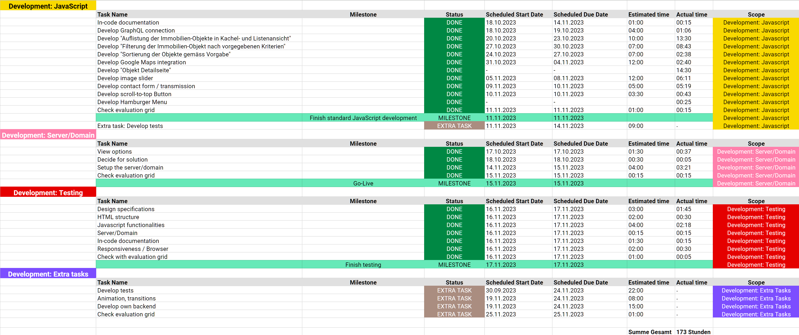

# Technische Dokumentation: DEV Diplomarbeit "Home & House"

## Inhaltsverzeichnis

- [Abstract / Management Summary](#abstract--management-summary)
- [Setup Guide](#setup-guide)
- [URL der lauffähigen Version](#url-der-lauffähigen-version)
- [Zeitplan / Meilensteine](#zeitplan--meilensteine)
- [Technologiekonzept inkl. Evaluation der eingesetzten Technologien, Begründung](#technologiekonzept-inkl-evaluation-der-eingesetzten-technologien-begründung)
- [Technische Dokumentation bei Eigenleistungen](#technische-dokumentation-bei-eigenleistungen)
- [Zusammenfassung und Ausblick, persönliche Anmerkungen](#zusammenfassung-und-ausblick-persönliche-anmerkungen)
- [Literaturverzeichnis, Quellenangaben bei Nutzung von externem Code](#literaturverzeichnis-quellenangaben-bei-nutzung-von-externem-code)
- [Eidesstattliche Erklärung ](#eidesstattliche-erklärung)

## Abstract / Management Summary

Der Auftrag besteht darin, eine Web-Applikation für das fiktive Immobilienunternehmen "Home & House" zu entwickeln. Das Layout und Design muss anhand der Vorgaben im [Figma](https://bit.ly/3trxvOW) umgesetzt werden.

Programmiert werden soll die Web-Applikation mit HTML, CSS (vorzugsweise SCSS) und JavaScript. Das Backend wird zur Verfügung gestellt.

Das Projekt muss mit [GitHub](https://github.com/) versioniert werden. Dafür wird ein von der Lehrgangsleitung erstelltes [Repository](https://github.com/WebProfessionals/dev23_lea) verwendet.

Neben der technischen Umsetzung soll auch eine Dokumentation mit vordefinierten Inhaltspunkten verfasst werden. Diese wird in Form einer README-Datei umgesetzt.

## Setup Guide

### npm-Pakete installieren

Nachem das Git-Repository geklont wurde, das Projekt im Code Editor öffnen und den folgenden Befehl ausführen:

```
npm install
```

Damit werden alle verwendeten npm-Pakete installiert.

Danach kann entweder der **Production-Mode** oder der **Development-Mode** gestartet werden.

### Development-Mode

Um den **Development-Mode** zu starten, muss der folgende Befehl ausgeführt werden:

```
npm start
```

### Production-Mode

Um den **Production-Mode** zu starten, muss der folgende Befehl ausgeführt werden:

```
npm run build
```

### SCSS Änderungen beobachten

Um Änderungen am SCSS Code zu beobachten, kann in einer zweiten Konsole, der untenstehende Befehl im Ordner **src/sass** ausgeführt werden:

```
sass --watch main.scss main.css
```

## URL der lauffähigen Version

## Zeitplan / Meilensteine

Meinen Projekt- und Zeitplan habe ich mit dem Tool [ClickUp](https://clickup.com/) erstellt. Folgend erläutere ich mein grobes Vorgehen.

### Vorgehen

- Definition von "Scopes". Dies sind die verschiedenen "Bereiche" der Diplomarbeit. Dazu gehören:
  - Project Management
  - Development: Tools
  - Documentation
  - Development: GitHub
  - Development: HTML
  - Development: CSS
  - Development: JavaScript
  - Development: Server/Domain
  - Development: Testing
  - Development: Extra tasks
  - Expert discussion
- Definition von Tasks und Subtasks
- Erstellung eines Zeitplans in Form einer Zeitleiste
- Definition von Milestones
- Schätzung der benötigten Zeit pro Task

Ich habe versucht, die Planung möglichst detailliert, aber dennoch mit Bedenken des zeitlich vorgegeben Rahmens, zu erarbeiten. Die Planung bringt für mich folgende Vorteile:

- Genaue Befassung mit den Anforderungen vor Entwicklung
- Risikominimierung, dass Anforderungen/Tasks untergehen
- Einfachere Einhaltung der Deadlines

**Kurz: Es ist mein roter Faden zur Durchführung und Entwicklung dieses Projektes.**

### Projekt-/Zeitplan

Folgend ist der Projekt-/Zeitplan im Soll-Zustand:




Folgend ist der Projekt-/Zeitplan im Ist-Zustand:

**UPDATE FOLGT**

## Technologiekonzept inkl. Evaluation der eingesetzten Technologien, Begründung

Ich verwende die Technologien, die wir im Unterricht erlernt haben:

- HTML
- BEM Namenskonvention für CSS-Klassen
- SCSS/CSS (Sass)
- Javascript Module Pattern
- Webpack
  - npm
  - Mode "Development" & "Production" (npm start / npm run build)
  - Loaders (für SCSS)
  - Cache Busting (mit Content-Hash)
  - HTML Webpack Plugin
  - Webpack Dev Server
  - HTML-Loader & Asset Modules
  - Clean Webpack Plugin
  - FOUC
  - CSS Extract
  - Multi Entrypoints
  - Includes (Partials)
  - _evt. (ImageMinimizerWebpackPlugin)_
- GraphQL (Abfragesprache für API)

## Technische Dokumentation bei Eigenleistungen

## Zusammenfassung und Ausblick, persönliche Anmerkungen

- Einrichtung _ImageMinimizerWebpackPlugin_ hat mehr Zeit gekostet, als erwartet (01.10.23)
- Musste zuerst wieder in HTML reinkommen (02.10.2023)
- Repetition & längere Recherche SCSS (Code-Struktur, Ordner/Parials) (09.10.2023)
- [SCSS 7-1 Pattern](https://sass-guidelin.es/#the-7-1-pattern): Ich verwende darauf basierende Struktur (5-1). `themes/` & `vendors/` benötige ich nicht (10.10.2023)
- Recherche bzgl. media queries - entschieden für Bootstrap 4 Breakpoints (10.10.2023) / Allenfalls werden nicht alle gebraucht (Zeit gebraucht, die ich nicht eingeplant hatte)
- Recherche bzgl. SCSS color variables / entschieden für "tier 1 & tier 2" Vorgehensweise [Quelle](https://markus.oberlehner.net/blog/two-tier-sass-variables-and-css-custom-properties/)
- Einbau Google Maps anhand [Google Artikel](https://developers.google.com/maps/documentation/javascript/adding-a-google-map?hl=de#javascript)
  - Ich habe das Copyright & die Nutzungsbedingungen mit CSS ausgeblendet. Auf einer produktiven Seite ist dies vermutlich aufgrund der [Nutzungsbedingungen](https://cloud.google.com/maps-platform/terms/) nicht erlaubt.

## Literaturverzeichnis, Quellenangaben bei Nutzung von externem Code

### Mobile Hamburger Navigation

Für die Mobile Hamburger Navigation habe ich mich an folgendem Artikel orientiert: ["Easy hamburger menu with JS - Beginners"](https://dev.to/ljcdev/easy-hamburger-menu-with-js-2do0). Den CSS und JavaScript Code habe ich in meine bereits bestehendes HTML-Struktur eingebaut. Um das gewünschte Ergebnis zu erzielen, habe ich ein paar Anpassungen und Ergänzungen vorgenommen (bspw. `overflowY`).

### Toggle Switch

Für den Toggle Switch habe ich mich am ersten Switch "Light" aus folgendem Code orientiert: [Codepen: CSS Toggle Switch button](https://codepen.io/alvarotrigo/pen/RwjEZeJ). Auch hier habe ich den Code für meine Zwecke modifiziert.

## Eidesstattliche Erklärung

Hiermit erkläre ich, dass ich die Diplomarbeit selbständig verfasst / programmiert und keine anderen als die angegebenen Quellen und Hilfsmittel benutzt und die aus fremden Quellen direkt oder indirekt übernommenen Gedanken als solche kenntlich gemacht habe. Die Arbeit habe ich bisher keinem anderen Prüfungsgremium in gleicher oder vergleichbarer Form vorgelegt. Sie wurde bisher auch nicht veröffentlicht.
