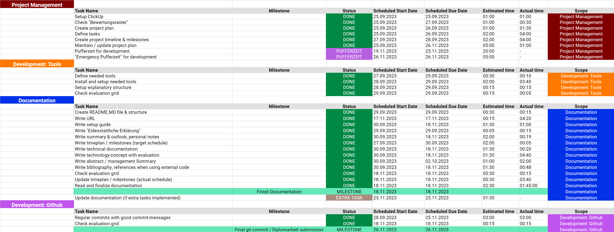

# Technische Dokumentation: DEV Diplomarbeit "Home & House"

## Inhaltsverzeichnis
- [Abstract / Management Summary](#abstract--management-summary)
- [Setup Guide](#setup-guide)
- [URL der lauffähigen Version](#url-der-lauffähigen-version)
- [Zeitplan / Meilensteine](#zeitplan--meilensteine)
- [Technologiekonzept inkl. Evaluation der eingesetzten Technologien, Begründung](#technologiekonzept-inkl-evaluation-der-eingesetzten-technologien-begründung)
- [Technische Dokumentation bei Eigenleistungen](#technische-dokumentation-bei-eigenleistungen)
- [Zusammenfassung und Ausblick, persönliche Anmerkungen](#zusammenfassung-und-ausblick-persönliche-anmerkungen)
- [Literaturverzeichnis, Quellenangaben bei Nutzung von externem Code](#literaturverzeichnis-quellenangaben-bei-nutzung-von-externem-code)
- [Eidesstattliche Erklärung ](#eidesstattliche-erklärung)

## Abstract / Management Summary

## Setup Guide

## URL der lauffähigen Version

## Zeitplan / Meilensteine
Meinen Projekt- und Zeitplan habe ich mit dem Tool [ClickUp](https://clickup.com/) erstellt. Folgend erläutere ich mein grobes Vorgehen.

### Vorgehen
- Definition von "Scopes". Dies sind die verschiedenen "Bereiche" der Diplomarbeit. Dazu gehören:
    - Project Management
    - Development: Tools
    - Documentation
    - Development: GitHub
    - Development: HTML
    - Development: CSS
    - Development: JavaScript
    - Development: Server/Domain
    - Development: Testing
    - Development: Extra tasks
    - Expert discussion
- Definition von Tasks und Subtasks
- Erstellung eines Zeitplans in Form einer Zeitleiste
- Definition von Milestones
- Schätzung der benötigten Zeit pro Task

Ich habe versucht die Planung möglichst detailliert, aber dennoch mit bedenken des zeitlich vorgegeben Rahmens, zu erarbeiten. Die Planung bringt für mich folgende Vorteile:
- Genaue Befassung mit den Anforderungen vor Entwicklung
- Risikominimierung, dass Anforderungen/Tasks untergehen
- Einfachere Einhaltung der Deadlines

**Kurz: Es ist mein roter Faden zur Durchführung und Entwicklung dieses Projektes.**

### Projekt-/Zeitplan
Folgend ist der Projekt-/Zeitplan im Soll-Zustand:

Folgend ist der Projekt-/Zeitplan im Ist-Zustand:

**UPDATE FOLGT**

## Technologiekonzept inkl. Evaluation der eingesetzten Technologien, Begründung
Ich verwende die Technologien, die wir im Unterricht erlernt haben:
- HTML
- BEM Namenskonvention für CSS-Klassen
- SCSS/CSS (Sass)
- Javascript Module Pattern
- Webpack
    - npm
    - Mode "Development" & "Production" (npm start / npm run build)
    - Loaders (für SCSS)
    - Cache Busting (mit Content-Hash)
    - HTML Webpack Plugin
    - Webpack Dev Server
    - HTML-Loader & Asset Modules
    - Clean Webpack Plugin
    - FOUC
    - CSS Extract
    - Multi Entrypoints
    - Includes (Partials)
    - *evt. (ImageMinimizerWebpackPlugin)*
- GraphQL (Abfragesprache für API)

## Technische Dokumentation bei Eigenleistungen

## Zusammenfassung und Ausblick, persönliche Anmerkungen
- Einrichtung *ImageMinimizerWebpackPlugin* hat mehr Zeit gekostet, als erwartet (01.10.23)

## Literaturverzeichnis, Quellenangaben bei Nutzung von externem Code

## Eidesstattliche Erklärung 
Hiermit erkläre ich, dass ich die Diplomarbeit selbständig verfasst / programmiert und keine anderen als die angegebenen Quellen und Hilfsmittel benutzt und die aus fremden Quellen direkt oder indirekt übernommenen Gedanken als solche kenntlich gemacht habe. Die Arbeit habe ich bisher keinem anderen Prüfungsgremium in gleicher oder vergleichbarer Form vorgelegt. Sie wurde bisher auch nicht veröffentlicht.